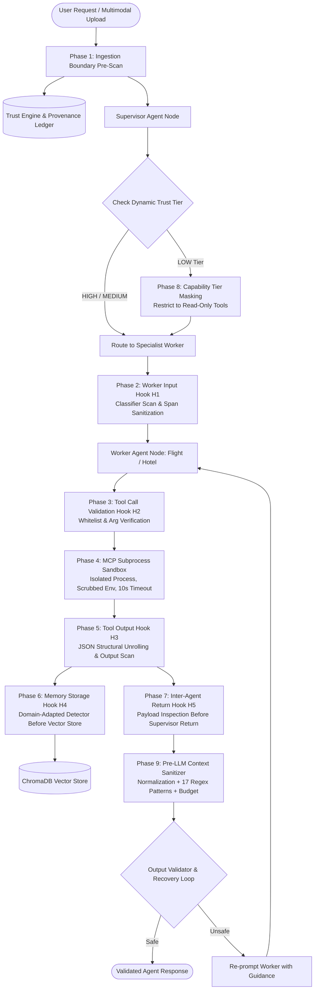

# Secure Agent Runtime

> **Orchestration-Level Defense-in-Depth and Dynamic Trust Evaluation for Multi-Agent LLM Systems**

[](https://www.python.org/)
[](LICENSE)
[](https://fastapi.tiangolo.com)
[](https://github.com/langchain-ai/langgraph)
[](Dockerfile)
[](agents/deterministic_agent.py)
[](tests/)

---

## Table of Contents

- [1. Executive Summary](#1-executive-summary)
  - [1.1 Background & Threat Model](#11-background--threat-model)
  - [1.2 Headline Empirical Results](#12-headline-empirical-results)
  - [1.3 Core Technical Contributions](#13-core-technical-contributions)
- [2. Architecture & 9-Phase Defense Pipeline](#2-architecture--9-phase-defense-pipeline)
  - [2.1 LangGraph Multi-Agent Architecture](#21-langgraph-multi-agent-architecture)
  - [2.2 Nine-Phase Sequential Interception Table](#22-nine-phase-sequential-interception-table)
  - [2.3 Multimodal Sanitization Subsystems](#23-multimodal-sanitization-subsystems)
  - [2.4 Trust Engine Mathematical Formulation](#24-trust-engine-mathematical-formulation)
  - [2.5 Detection Backends: Latency vs. Precision](#25-detection-backends-latency-vs-precision)
- [3. Installation & Environment Setup](#3-installation--environment-setup)
  - [3.1 Prerequisites & System Dependencies](#31-prerequisites--system-dependencies)
  - [3.2 Local Virtual Environment Setup](#32-local-virtual-environment-setup)
  - [3.3 Environment Configuration (`.env`)](#33-environment-configuration-env)
  - [3.4 Containerized Deployment (Docker)](#34-containerized-deployment-docker)
- [4. Quick Start & Minimal Reproducible Examples](#4-quick-start--minimal-reproducible-examples)
  - [4.1 Interactive Smoke Test](#41-interactive-smoke-test)
  - [4.2 Local Server Launch](#42-local-server-launch)
  - [4.3 Web Dashboard](#43-web-dashboard)
  - [4.4 Minimal Programmatic Python Usage](#44-minimal-programmatic-python-usage)
- [5. REST API Reference](#5-rest-api-reference)
  - [5.1 Authentication & Security Controls](#51-authentication--security-controls)
  - [5.2 Endpoint Catalog](#52-endpoint-catalog)
  - [5.3 Example API Invocations](#53-example-api-invocations)
- [6. Evaluation & Experimental Reproducibility](#6-evaluation--experimental-reproducibility)
  - [6.1 Dual Evaluation Tracks Overview](#61-dual-evaluation-tracks-overview)
  - [6.2 Track 1: Reproducing Headline Results (Deterministic Oracle)](#62-track-1-reproducing-headline-results-deterministic-oracle)
  - [6.3 Track 1: Full Security Benchmark Suite (R3–R9 Matrix)](#63-track-1-full-security-benchmark-suite-r3r9-matrix)
  - [6.4 Statistical Significance & Effect Size Testing](#64-statistical-significance--effect-size-testing)
  - [6.5 Publication Figure Generation](#65-publication-figure-generation)
  - [6.6 Track 2: Paper Live-LLM Programme](#66-track-2-paper-live-llm-programme)
- [7. Classifier Training & Domain Adaptation](#7-classifier-training--domain-adaptation)
  - [7.1 Retraining the Input Prompt Detector](#71-retraining-the-input-prompt-detector)
  - [7.2 Training the Memory Boundary Detector](#72-training-the-memory-boundary-detector)
- [8. Testing & Verification Suite](#8-testing--verification-suite)
  - [8.1 Core Architectural & Phase Unit Tests](#81-core-architectural--phase-unit-tests)
  - [8.2 Multimodal Stress Testing](#82-multimodal-stress-testing)
  - [8.3 Live Server End-to-End Tests](#83-live-server-end-to-end-tests)
- [9. Security Hardening & Production Configuration](#9-security-hardening--production-configuration)
  - [9.1 Central Configuration Parameter Matrix](#91-central-configuration-parameter-matrix)
  - [9.2 Production Hardening Principles](#92-production-hardening-principles)
- [10. Project Directory Layout](#10-project-directory-layout)
- [11. Methodological Boundaries & Limitations](#11-methodological-boundaries--limitations)
  - [11.1 Scientific Boundaries](#111-scientific-boundaries)
  - [11.2 Engineering Boundaries](#112-engineering-boundaries)
- [12. Citation & Academic Attribution](#12-citation--academic-attribution)
- [13. Contributing & Code Quality](#13-contributing--code-quality)
- [14. License](#14-license)

---

## 1. Executive Summary

### 1.1 Background & Threat Model

Autonomous multi-agent LLM systems that invoke external tools, persist context to vector databases, and process multimodal inputs face severe architectural vulnerabilities:
- **Direct Prompt Injection:** Adversarial user turns designed to override system constraints and hijack agent goals.
- **Indirect Prompt Injection:** Poisoned tool outputs, contaminated external API payloads, or malicious retrieved memory fragments (RAG poisoning) that compromise the execution loop.
- **Confused Deputy Problem:** Sub-agents executing unauthenticated, high-privilege write actions based on untrusted instructions returned across agent boundaries.
- **Cross-Modality Injections:** Payloads hidden in image text layers (OCR), EXIF metadata, audio voice memos, video frame text, or PDF document annotations and JavaScript streams.

The **Secure Agent Runtime** provides an orchestration-level security architecture built on **LangGraph**. It surrounds multi-agent execution with a **nine-phase defense-in-depth pipeline**, an algorithmic **Provenance Ledger**, a multi-component **Trust Engine**, and strict **Model Context Protocol (MCP) subprocess sandboxing**.

### 1.2 Headline Empirical Results

All primary reported figures are evaluated using a **deterministic, zero-resistance "susceptible-model" oracle** (`agents/deterministic_agent.py`) paired with an automated canary/behavioral judge (`scripts/judge.py`). This guarantees that every blocked attack is attributable exclusively to the defense pipeline rather than an underlying commercial LLM's safety training, while eliminating live API rate limits, costs, and stochastic nondeterminism.

Against an **adaptive adversary** comprising 600 obfuscated attacks across 5 distinct categories (base64, leetspeak, Unicode homoglyphs; `datasets/adaptive_attacks.json`), evaluated against an oracle that dynamically decodes obfuscations:

| Evaluation Condition (Baseline ASR: 60.0%) | Secured Runtime (No Input Normalization) | Secured Runtime (With Input Normalization) |
| :----------------------------------------- | :---------------------------------------: | :----------------------------------------: |
| **Attack Success Rate (ASR)**              | **16.8%**                                 | **0.0%** \*                                |
| **ASR 95% Wilson Confidence Interval**     | [14.0, 20.0]%                             | [0.0, 0.64]%                               |
| **False Positive Rate (FPR)**              | **0.0%**                                  | **0.0%**                                   |
| **Task Accuracy Retention (TAR)**          | **100.0%**                                | **100.0%**                                 |
| **Policy Compliance Rate**                 | 83.2%                                     | 100.0%                                     |
| **Mean Execution Latency**                 | 1.08 s                                    | 1.08 s                                     |

> [!IMPORTANT]
> **Methodological Disclosure — Conservative Residual Reporting:**
> The 0.0% operating point with normalization enabled is *pattern-coupled*: the defense normalizer (`sanitizers/normalize.py`) decodes the same structural encodings that the susceptible oracle parses. It measures coverage over *known* transformations, not generalized immunity to zero-day encodings. 
> 
> Therefore, this repository **leads with the 16.8% residual** (achieved without normalization) as the defensible, conservative robustness figure. The unnormalized residual is isolated in indirect injection (30%), tool misuse (27%), and memory poisoning (25%), while direct injection is reduced to 2% and role override to 0%.

On the **standard directive-form attack corpus** (100 attacks, 96 benign tasks; `datasets/attacks.json`):
- **Baseline ASR:** 74.0% $\rightarrow$ **Secured ASR:** 0.0%
- **McNemar Test:** $\chi^2 = 72.01$, $p = 1.06 \times 10^{-22}$ (statistically significant at $\alpha = 0.05$)
- **Effect Size:** Cohen's $h = 2.0715$ (Large effect magnitude)
- **Mean Latency Overhead:** $+193.6\text{ ms}$ ($1307.5\text{ ms} \rightarrow 1501.1\text{ ms}$, paired $t = -2.31$, $p = 0.023$)

### 1.3 Core Technical Contributions

1. **Deterministic, Defense-Attributable Evaluation Harness (`agents/deterministic_agent.py`):** An offline oracle that replaces stochastic live LLMs. Eliminates non-reproducibility, excludes trial errors from ASR calculations, and measures true task execution for Task Accuracy Retention (TAR).
2. **Nine-Phase Interception Topology:** Sequentially placed security controls spanning ingress, agent worker boundaries, tool calls, tool outputs, vector memory storage, supervisor handoffs, dynamic privilege masking, and pre-LLM context synthesis.
3. **Formal Provenance & Dynamic Trust Engine:** Content-addressed hashing with deduplicated decay ($H(\sigma) = \rho^{|D|}$), source reliability weighting ($S(x)$), cosine memory retrieval confidence ($R(x)$), and monotonic session-tier flooring ($\text{Tier}(\sigma) = \min_k \text{Tier}(x_k)$).
4. **Subprocess Tool Isolation:** Real Model Context Protocol (MCP) execution inside distinct Python subprocesses with scrubbed environments, strict token validation, and timeouts (`agents/mcp_sandbox.py`).
5. **Multi-Stage Steganalysis & Ingestion Forensics:** Real $\chi^2$ Least Significant Bit (LSB) steganalysis for images, structural PDF token/JS inspection, and EXIF/metadata extraction.

---

## 2. Architecture & 9-Phase Defense Pipeline

### 2.1 LangGraph Multi-Agent Architecture



### 2.2 Nine-Phase Sequential Interception Table

The runtime coordinates nine defensive checkpoints structured across the LangGraph state machine:

| Phase | Checkpoint Name | Component / Hook | Mechanism & Security Function |
| :---: | :--- | :---: | :--- |
| **1** | **Ingestion Boundary Pre-Scan** | Ingestion Layer | Scans raw prompt & extracted multimodal text before graph compilation; demotes initial trust score upon detected injection without brittle hard-refusal. |
| **2** | **Worker Input Interception** | `H1` (`worker_input_hook`) | Tokenizes user turn prior to worker inference; scans via local transformer classifier; strips malicious substrings replacing them with `[SANITIZED]`. |
| **3** | **Tool Call Validation** | `H2` (`tool_call_hook`) | Validates requested tool names and arguments against strict schema allow-lists; prevents unauthenticated state writes at degraded trust tiers. |
| **4** | **Sandboxed Tool Execution** | `mcp_sandbox.py` | JSON-RPC subprocess sandbox. Runs tool execution in a detached OS process with secrets stripped from the environment, resource limits, and a 10s hard timeout. |
| **5** | **Tool Output Interception** | `H3` (`tool_output_hook`) | Structurally unrolls nested JSON outputs, recursively inspects string leaves, detects tool-returned indirect injections, and redacts poisoned content. |
| **6** | **Memory Storage Interception** | `H4` (`memory_storage_hook`) | Screens conversation state through a fine-tuned memory boundary detector (`models/memory_prompt_detector/`) before persistence to ChromaDB. |
| **7** | **Inter-Agent Return Interception**| `H5` (`inter_agent_hook`) | Inspects worker agent responses before yielding control back to the supervisor; terminates cross-agent privilege propagation. |
| **8** | **Dynamic Capability Tier Masking**| Policy Enforcer | Enforces capability partitioning (`HIGH` $\rightarrow$ full execution; `MEDIUM` $\rightarrow$ step-up confirmation; `LOW` $\rightarrow$ high-risk state-changing tools masked). |
| **9** | **Pre-LLM Context Sanitization** | `pre_llm.py` | Normalizes obfuscations (base64/leet/homoglyph), evaluates 17 compiled regex patterns within a 50 ms budget, and applies fail-closed boundary spotlighting. |

### 2.3 Multimodal Sanitization Subsystems

The runtime accepts raw binary streams across multiple modalities and routes them through specialized extractors before pipeline ingestion:

- **Text:** Processed via pluggable classifiers (`distilbert`, `deberta-pi`, `promptguard2`, or `ensemble`).
- **Image:** Extracted via local Tesseract OCR (or GPT-4o-mini Vision when configured), EXIF metadata inspection, and $\chi^2$ Least Significant Bit (LSB) steganalysis (`sanitizers/forensics.py`).
- **Audio:** Transcribed via local OpenAI-Whisper or Whisper API; transcribes spoken injection directives.
- **Video:** Frame-extracted via OpenCV, keyframes processed with OCR and visual description.
- **PDF Documents:** Dual-layer extraction via PyMuPDF (`fitz`) text-layer analysis, rasterized page OCR, and structural inspection for embedded JavaScript (`/JavaScript`, `/JS`) and metadata injections.
- **RAG & Tool Outputs:** Vector fragments screened by memory-adapted classifiers; JSON structures recursively flattened.

### 2.4 Trust Engine Mathematical Formulation

Trust is tracked on a continuous scale $[0.0, 1.0]$ and mapped to discrete operational tiers:

$$T(x, \sigma) = \alpha S(x) + \beta P(x) + \gamma H(\sigma) + \delta R(x)$$

Where:
- $\alpha = \beta = \gamma = \delta = 0.25$ (normalized equal weights; configurable via environment).
- $S(x) \in \{1.0, 0.5, 0.4, 0.3\}$: Source reliability tier ($S_{\text{system}} = 1.0$, $S_{\text{user}} = 0.5$, $S_{\text{memory}} = 0.4$, $S_{\text{tool}} = 0.3$).
- $P(x) \in \{0.0, 1.0\}$: Policy compliance evaluation (1.0 if compliant, 0.0 if flagged by sanitizers).
- $H(\sigma) = \rho^{|D|}$ with $\rho = 0.3$: Historical decay. On each unique registered injection in session $\sigma$, history decays multiplicatively. Unique injections are deduplicated via SHA-256 content digests ($D$), preventing artificial trust collapse from repeated hook scans.
- $R(x) = \max(0, \cos(\mathbf{q}, \mathbf{k}))$: Cosine similarity of retrieved vector memory fragments against the active query (defaults to 1.0 for non-RAG turns).

**Operational Tiers & Monotonic Session Floor:**
$$\text{Tier}(T) = \begin{cases} \text{HIGH} & T \ge 0.8 \\ \text{MEDIUM} & 0.4 \le T < 0.8 \\ \text{LOW} & T < 0.4 \end{cases}$$

Under session aggregation (`TRUST_AGGREGATION=session`), the session tier is monotonic non-increasing:
$$\text{Tier}(\sigma_k) = \min_{1 \le i \le k} \text{Tier}(x_i)$$
Once demoted to `LOW`, a session cannot regain access to privileged tools within the same execution context.

### 2.5 Detection Backends: Latency vs. Precision

The runtime supports interchangeable transformer backends configured via `DETECTOR_BACKEND`:

| Backend Name | Model / Source | Parameters | Batch CPU Latency (240 prompts) | Primary Operational Profile |
| :--- | :--- | :---: | :---: | :--- |
| **`distilbert`** (Default) | Local fine-tuned checkpoint (`models/prompt_detector/`) | 66M | **1.66 s** | Ultra-low CPU latency profile; zero-dependency offline inference. |
| **`deberta-pi`** | `protectai/deberta-v3-base-prompt-injection-v2` | 86M | 5.82 s (7 ms on CUDA) | High-precision backend; eliminates false positives on benign imperatives. |
| **`promptguard2`** | `meta-llama/Llama-Prompt-Guard-2-86M` | 86M | ~5.20 s | Aligned with Meta Llama safety taxonomy. |
| **`ensemble`** | Max-pooling over available detectors | — | Cumulative | Maximum security perimeter; triggers if any detector flags injection. |

---

## 3. Installation & Environment Setup

### 3.1 Prerequisites & System Dependencies

- **Python:** Version `3.11` or `3.12`
- **Docker:** Version `24.0+` & Docker Compose (optional, for containerized run)
- **Native OS Libraries (Required for Multimodal OCR and Video/Audio):**

<details>
<summary><b>Linux (Ubuntu / Debian)</b></summary>

```bash
sudo apt-get update && sudo apt-get install -y --no-install-recommends \
    build-essential \
    tesseract-ocr \
    ffmpeg \
    libgl1 \
    libglib2.0-0
```
</details>

<details>
<summary><b>macOS (Homebrew)</b></summary>

```bash
brew update && brew install tesseract ffmpeg
```
</details>

<details>
<summary><b>Windows (Winget)</b></summary>

```powershell
winget install UB-Mannheim.TesseractOCR
winget install Gyan.FFmpeg
# Ensure Tesseract and FFmpeg are added to your system PATH
```
</details>

### 3.2 Local Virtual Environment Setup

Clone the repository and prepare an isolated virtual environment:

#### On Linux / macOS (Bash):
```bash
git clone https://github.com/aliakarma/secure-agent-runtime.git
cd secure-agent-runtime

python3 -m venv venv
source venv/bin/activate
pip install --upgrade pip
pip install -r requirements.txt
```

#### On Windows (PowerShell):
```powershell
git clone https://github.com/aliakarma/secure-agent-runtime.git
cd secure-agent-runtime

python -m venv venv
Set-ExecutionPolicy -ExecutionPolicy RemoteSigned -Scope Process
.\venv\Scripts\Activate.ps1
python -m pip install --upgrade pip
pip install -r requirements.txt
```

### 3.3 Environment Configuration (`.env`)

Copy the configuration template:

```bash
# Linux / macOS
cp .env.example .env

# Windows PowerShell
Copy-Item .env.example .env
```

Configure your parameters in `.env`:
```env
# Mandatory for live LLM workflows (GPT-4o-mini agent and Whisper)
OPENAI_API_KEY=sk-proj-...

# Application Environment: 'development' (default) or 'production'
APP_ENV=development

# API Authentication Token (Mandatory when APP_ENV=production)
API_TOKEN=

# Detector Backend: distilbert (default, CPU-fast) or deberta-pi (high-precision)
DETECTOR_BACKEND=distilbert
DETECTOR_THRESHOLD=0.5

# Security Strictness: 0 = graceful degrade to heuristics; 1 = fail closed
STRICT_SECURITY=0
```

### 3.4 Containerized Deployment (Docker)

To deploy the fully packaged runtime with all native OCR, audio, and video libraries compiled inside a hardened multi-stage container:

```bash
# Build and run with Docker Compose
docker-compose up --build -d

# Check service health
curl -f http://localhost:8080/health
```

Access the interactive dashboard at: `http://localhost:8080/static/index.html`.

---

## 4. Quick Start & Minimal Reproducible Examples

### 4.1 Interactive Smoke Test

Run the pre-flight verification script to test OpenAI API connectivity (if configured) and execute a sample travel booking graph:

```bash
python run_demo.py
```

### 4.2 Local Server Launch

Launch the FastAPI server with hot-reload enabled:

```bash
uvicorn main:app --host 0.0.0.0 --port 8080 --reload
```

- **API Documentation (Swagger UI):** `http://localhost:8080/docs`
- **OpenAPI Schema:** `http://localhost:8080/openapi.json`
- **Liveness Probe:** `http://localhost:8080/health`

### 4.3 Web Dashboard

Navigate to `http://localhost:8080/static/index.html` to access the interactive web interface:
1. **Interactive Chat:** Test travel booking requests under active defense.
2. **Multimodal Simulator:** Test image OCR injections, audio memos, and PDF uploads.
3. **Telemetry & Provenance Inspector:** Monitor real-time security events and inspect GraphChain DAG trust lineage.

### 4.4 Minimal Programmatic Python Usage

You can invoke the secured multi-agent graph directly inside Python:

```python
from agents.workflow import run_travel_graph

# Execute a benign travel booking prompt
result = run_travel_graph(
    user_input="Book me a flight to Paris and find a hotel near the Eiffel Tower.",
    session_id="session_user_01"
)

print(f"Status: {result.get('status')}")
print(f"Trust Score: {result.get('trust_score'):.2f}")
print(f"Trust Tier: {result.get('trust_tier')}")

# Inspect agent conversation transcript
for message in result.get("messages", []):
    role = getattr(message, "name", "") or type(message).__name__
    print(f"[{role}]: {message.content}")
```

---

## 5. REST API Reference

### 5.1 Authentication & Security Controls

When running in production (`APP_ENV=production`) or whenever `API_TOKEN` is configured:
- All mutating and data-retrieval endpoints require an authorization header:
  `Authorization: Bearer <API_TOKEN>` or `X-API-Token: <API_TOKEN>`
- Missing or invalid tokens return `401 Unauthorized` via constant-time comparison (`hmac.compare_digest`).
- Upload payloads exceeding `MAX_UPLOAD_BYTES` (default: 25 MiB) are rejected with `413 Payload Too Large`.

### 5.2 Endpoint Catalog

| Method | Endpoint | Tags | Description |
| :---: | :--- | :---: | :--- |
| `GET` | `/health` | Infrastructure | Liveness probe; returns HTTP 200 when service is running. |
| `GET` | `/ready` | Infrastructure | Readiness probe; verifies database and model readiness. |
| `GET` | `/dashboard` | UI | Redirects to `/static/index.html`. |
| `POST`| `/run-travel-graph` | Execution | Executes text-only travel booking multi-agent graph. |
| `POST`| `/run-travel-multimodal` | Execution | Executes travel graph with image, audio, video, or PDF input. |
| `POST`| `/api/generate-preset` | Testing | Generates benign or injected media fixtures for evaluation. |
| `POST`| `/api/extract-text` | Multimodal | Extracts text/transcription from uploaded files without agent execution. |
| `GET` | `/api/events` | Telemetry | Streams real-time security events filtered by session. |
| `GET` | `/api/provenance` | Auditing | Returns linear provenance records for a given `session_id`. |
| `GET` | `/api/provenance-dag` | Auditing | Returns provenance lineage as a node/edge directed acyclic graph. |
| `GET` | `/api/graphchain` | Auditing | Returns GraphChain cross-modality trust fusion maps. |
| `GET` | `/api/threat-model` | Research | Exposes formal threat model definitions and formal contributions. |
| `GET` | `/api/trust-model` | Research | Exposes current Trust Engine weights, formula, and thresholds. |
| `GET` | `/api/detector` | Research | Exposes active detector backend metrics and threshold. |
| `GET` | `/api/research/baselines` | Research | Returns external defense baseline catalog and proxy metrics. |
| `GET` | `/api/research/adaptive` | Research | Returns per-technique adaptive attack detection recall. |
| `GET` | `/api/research/experiments`| Research | Aggregates all pre-computed experimental JSON summaries. |
| `GET` | `/api/research/forensics` | Research | Runs image metadata extraction and $\chi^2$ LSB steganalysis. |
| `GET` | `/api/reproducibility` | Research | Exposes reproducibility manifest and AgentDojo adapter status. |

### 5.3 Example API Invocations

#### Text Agent Execution:
```bash
curl -X POST "http://localhost:8080/run-travel-graph?user_input=Book%20a%20flight%20to%20Tokyo&session_id=demo_01" \
     -H "Authorization: Bearer test-token"
```

#### Multimodal File Upload (Direct Image Prompt Injection):
```bash
curl -X POST "http://localhost:8080/run-travel-multimodal" \
     -H "Authorization: Bearer test-token" \
     -F "modality=image" \
     -F "file=@datasets/preset_ocr_injection.png" \
     -F "session_id=demo_img_01"
```

---

## 6. Evaluation & Experimental Reproducibility

### 6.1 Dual Evaluation Tracks Overview

To guarantee complete scientific integrity, this repository strictly separates two evaluation workflows:

1. **Track 1: Offline Deterministic Benchmark Suite (Primary Codebase Artifact):**
   - Driven by `agents/deterministic_agent.py` and `scripts/judge.py`.
   - **Cost: $0.00** | **Requires API Key: No** | **Stochastic Variance: 0.0%**.
   - Evaluates a zero-resistance susceptible oracle to ensure defense attribution.
   - Generates all headline numbers reported in Section 1.2.
2. **Track 2: Research Paper Live-LLM Programme (Manuscript Measurements):**
   - Driven by `scripts/run_all_paper_experiments.py` and `scripts/llm_judge.py`.
   - Evaluates live commercial and open-weights models (`Llama-3.1-8B-Instruct` via local vLLM and `gpt-4o-mini-2024-07-18` via OpenAI API) scored by a GPT-4o judge.
   - Pre-computed paper execution artifacts are fully preserved in `results/`.

### 6.2 Track 1: Reproducing Headline Results (Deterministic Oracle)

You can reproduce the headline empirical evaluations with single commands:

```bash
# 1. Base Benchmark Evaluation (100 directive-form attacks vs 96 benign tasks)
python scripts/run_baseline_vs_secured.py --deterministic --seed 42

# 2. Adaptive Adversary Evaluation (600 obfuscated attacks: base64, leetspeak, homoglyphs)
python scripts/run_baseline_vs_secured.py --deterministic --seed 42 \
    --attacks-file datasets/adaptive_attacks.json --tag r3_adaptive

# 3. Statistical Significance Analysis (McNemar, Paired t-test, Cohen's h, Wilson CIs)
python scripts/statistical_tests.py

# 4. Multimodal Forensics Smoke Test (OCR, EXIF, and Chi-Square Steganalysis)
python scripts/run_multimodal_smoke.py
```

### 6.3 Track 1: Full Security Benchmark Suite (R3–R9 Matrix)

To execute all 8 security experiments sequentially completely offline:

```bash
python scripts/run_all_experiments.py
```

Or run individual experimental phases:

| Experiment Code | Focus & Description | Execution Command | Output Artifact Path |
| :--- | :--- | :--- | :--- |
| **R3** | Matched-Pair Baseline vs. Secured | `python scripts/run_baseline_vs_secured.py --seed 42` | `datasets/r3_comparison_summary.json` |
| **R4a** | Layer Ablation Study (Configs A, B, C) | `python scripts/run_ablation_study.py --seed 42` | `datasets/r4_ablation_summary.json` |
| **R4b** | Hook Isolation Benchmark (Hooks 1–5) | `python scripts/run_isolation_benchmarks.py` | `datasets/r4_hook_isolation_summary.json` |
| **R5** | Multimodal Smoke & Steganalysis | `python scripts/run_multimodal_smoke.py` | `datasets/r5_multimodal_smoke_summary.json` |
| **R5-Regex** | Regex Perimeter Baseline Comparison | `python scripts/run_regex_baseline.py` | `datasets/r5_regex_baseline_summary.json` |
| **R6** | Deterministic Policy Evaluator Validation | `python scripts/evaluate_policy_validation.py` | `datasets/policy_validation_report.json` |
| **R7** | Cross-Agent Propagation Simulation | `python scripts/evaluate_cross_agent_propagation.py` | `datasets/cross_agent_propagation_summary.json` |
| **R8** | Trust Consistency & Deduplication Audit | `python scripts/evaluate_trust_consistency.py` | `datasets/trust_consistency_summary.json` |
| **R9** | Task Accuracy Retention (TAR) Analysis | `python scripts/evaluate_task_accuracy.py` | `datasets/task_accuracy_summary.json` |

### 6.4 Statistical Significance & Effect Size Testing

Calculate rigorous inferential statistics over experiment trial logs:

```bash
python scripts/statistical_tests.py
```

Outputs `datasets/statistical_significance.json`, verifying:
- **McNemar $\chi^2$ Test with continuity correction:** Evaluates proportion difference between paired baseline and secured conditions.
- **Paired $t$-Test on Latency:** Quantifies runtime performance overhead per turn.
- **Cohen's $h$:** Measures effect size magnitude between attack success proportions.
- **Bootstrap 95% Confidence Intervals:** 10,000 resamples for non-parametric interval estimation.

### 6.5 Publication Figure Generation

Generate all publication-grade figures from experimental artifacts:

```bash
python scripts/plotting/generate_figures.py
```

Generated plots are saved directly to `docs/figures/`:
1. `asr_comparison_plot.png` — Attack Success Rate comparison across ingestion pathways.
2. `ablation_diagrams.png` — Incremental protection gains across configurations.
3. `confusion_matrices.png` — Confusion matrices across individual interception hooks.
4. `latency_comparison_charts.png` — Latency decomposition per security phase.
5. `tar_tradeoff_plot.png` — Task accuracy retention vs. security strictness frontier.
6. `trust_degradation_curves.png` — Algorithmic trust score decay under consecutive attacks.

### 6.6 Track 2: Paper Live-LLM Programme

To inspect the orchestrator that reproduces the live-LLM evaluation runs reported in the manuscript:

```bash
# Dry-run: display the planned experimental stages without executing
python scripts/run_all_paper_experiments.py --dry-run

# Run preparation stage (benchmark corpora generation and contamination audit)
python scripts/run_all_paper_experiments.py --stage prep
```

> [!NOTE]
> Executing the complete live-LLM programme requires a dedicated local vLLM instance serving `meta-llama/Llama-3.1-8B-Instruct` and an active OpenAI API subscription for GPT-4o-mini and GPT-4o judging (estimated API cost: ~$430). All final measured results are already checked into `results/`.

---

## 7. Classifier Training & Domain Adaptation

The runtime ships with fine-tuned model checkpoints in `models/`. To retrain models from scratch using curated corpora in `datasets/`:

### 7.1 Retraining the Input Prompt Detector

Trains a local DistilBERT sequence classifier on balanced benign requests and direct prompt injections:

```bash
python scripts/train_local_classifier.py
```
- **Training Corpus:** `datasets/finetune_train.json`
- **Output Weights:** `models/prompt_detector/`
- **Validation Metrics:** Precision, recall, and ROC-AUC exported upon training completion.

### 7.2 Training the Memory Boundary Detector

Trains the domain-adapted classifier designed to detect indirect injection vectors inside vector memory fragments:

```bash
python scripts/train_memory_detector.py
```
- **Output Checkpoint:** `models/memory_prompt_detector/`
- **Domain Adaptation:** Fine-tuned on synthetic poisoned RAG contexts and memory-boundary payloads.

---

## 8. Testing & Verification Suite

The repository incorporates 166 pytest cases across 15 test suites in `tests/`:

### 8.1 Core Architectural & Phase Unit Tests

Execute core mathematical, policy, hook, and graph unit tests (52 tests, completely offline, runs in ~5 seconds):

```bash
pytest tests/test_phase1.py \
       tests/test_phase2.py \
       tests/test_phase4.py \
       tests/test_phase5.py \
       tests/test_phase6.py \
       tests/test_phase7.py \
       tests/test_phase8.py \
       tests/test_phase9.py \
       tests/test_trust_revision.py \
       tests/test_graphchain.py \
       tests/test_judge.py \
       tests/test_mcp_sandbox.py -v
```

### 8.2 Multimodal Stress Testing

Execute the complete multimodal test suite:

```bash
# Recommended: run with DeBERTa-PI to test high-precision multimodal assertions
DETECTOR_BACKEND=deberta-pi pytest tests/test_multimodal.py tests/test_multimodal_stress.py -v
```

> [!TIP]
> When running multimodal tests with the default `DETECTOR_BACKEND=distilbert`, DistilBERT's known conservative bias on benign imperative phrases ("Book me a flight based on this image...") can trigger sanitization flags. Use `DETECTOR_BACKEND=deberta-pi` for zero-FPR test validation on complex imperatives.

### 8.3 Live Server End-to-End Tests

Execute end-to-end integration tests against a running FastAPI instance:

```bash
# Terminal 1: Launch runtime server
uvicorn main:app --host 0.0.0.0 --port 8080

# Terminal 2: Run E2E test suite (18 multimodal tests)
python e2e_test.py
```

---

## 9. Security Hardening & Production Configuration

### 9.1 Central Configuration Parameter Matrix

All runtime behavior is centrally managed in `config.py` and configurable via `.env`:

| Parameter | Type | Default | Production Default | Security Function |
| :--- | :---: | :---: | :---: | :--- |
| `APP_ENV` | String | `development` | `production` | Flips permissive developer conveniences to strict security. |
| `API_TOKEN` | String | `""` | **Required** | Constant-time bearer token authorization. Server refuses startup if empty in production. |
| `ALLOWED_ORIGINS` | CSV | `""` (Same-Origin) | Explicit List | Restricts CORS browser origins. |
| `MAX_UPLOAD_BYTES` | Integer | `26214400` (25 MiB) | `26214400` | Streamed upload body guard defending against memory exhaustion. |
| `ALLOW_SIDECAR` | Boolean | `True` | `False` | Disables user-supplied text extraction caches; enforces live OCR/transcription. |
| `ALLOW_FILE_PATH` | Boolean | `True` | `False` | Disables arbitrary server paths; contains file access to sandboxed `uploads/`. |
| `STRICT_SECURITY` | Boolean | `False` | `True` | Fail-closed posture: extractor or classifier errors trigger hard-refusal rather than degrading. |
| `DETECTOR_BACKEND` | String | `distilbert` | `deberta-pi` | Choice of transformer sequence classifier backend. |
| `DETECTOR_THRESHOLD` | Float | `0.5` | `0.5` | Classification probability boundary for injection labeling. |
| `TRUST_AGGREGATION` | String | `turn` | `session` | `session` applies monotonic running-minimum flooring to prevent trust recovery. |
| `MCP_ISOLATION` | Boolean | `True` | `True` | Executes tools inside isolated OS subprocesses with scrubbed environments. |
| `BOUNDARY_MARKING` | Boolean | `True` | `True` | Injects spotlighting structural tags around untrusted context. |
| `PRE_LLM_SPAN_BUDGET_MS` | Float | `50.0` | `50.0` | Per-span regex evaluation deadline; fails closed (masks) upon expiry. |

### 9.2 Production Hardening Principles

1. **Authentication Enforcement:** Under `APP_ENV=production`, `main.py` enforces a non-empty `API_TOKEN` at startup, raising a `RuntimeError` and exiting immediately if unprotected.
2. **Local File Inclusion (LFI) Containment:** File reading helpers enforce strict path realpath containment (`_is_within_allowed`), rejecting path-traversal sequences (`../`) outside designated sandboxes.
3. **Subprocess Isolation (`agents/mcp_sandbox.py`):** Tool calls are executed in isolated Python child processes. Process environment variables are stripped of credentials (`OPENAI_API_KEY`, tokens) before invocation.

---

## 10. Project Directory Layout

```
secure-agent-runtime/
├── main.py                          # FastAPI server & route handlers
├── config.py                        # Centralized settings & environment bindings
├── logging_config.py                # Structured JSON/Console logging setup
├── dashboard_events.py              # In-memory circular telemetry event bus
├── research_meta.py                 # Threat model specs, catalogs, & reproducibility manifest
├── e2e_test.py                      # End-to-end live server test harness (18 tests)
├── run_demo.py                      # Quick start smoke test script
├── Dockerfile                       # Multi-stage production container definition
├── docker-compose.yml               # Multi-service composition (Runtime + ChromaDB)
├── requirements.txt                 # Pinned project dependencies
├── pytest.ini                       # Test suite runner configuration
├── agents/                          # LangGraph Multi-Agent Architecture
│   ├── workflow.py                  # State graph compiler (Supervisor & Workers)
│   ├── state.py                     # AgentState TypedDict schema definition
│   ├── deterministic_agent.py       # Deterministic zero-resistance evaluation oracle
│   ├── mcp_sandbox.py               # MCP subprocess sandbox runner
│   ├── tools.py                     # Tool schemas & secure wrapper definitions
│   ├── tool_impls.py                # Underlying mock tool implementations
│   ├── nodes/                       # Agent nodes (Supervisor, Flight, Hotel)
│   └── memory/                      # ChromaDB persistent vector memory adapter
├── sanitizers/                      # Interception & Sanitization Subsystems
│   ├── hooks.py                     # Interception hooks H1–H5 & dynamic tier masking
│   ├── multimodal.py                # Text, Visual, Audio, Video, PDF, & RAG sanitizers
│   ├── trust_engine.py              # Mathematical trust engine with content-hash dedup
│   ├── pre_llm.py                   # Context sanitizer (17 regex patterns + budget guard)
│   ├── normalize.py                 # Obfuscation decoder (base64, leetspeak, homoglyphs)
│   ├── forensics.py                 # Chi-square LSB steganalysis & image metadata
│   ├── output_validator.py          # Output validator & safety policy agent
│   ├── recovery_loop.py             # Re-prompting and regeneration recovery loop
│   └── session_store.py             # Memory, SQLite, and Redis persistent session stores
├── trust/
│   └── graphchain.py                # GraphChain structural lineage & DAG mapping
├── models/                          # Fine-Tuned Model Weights
│   ├── prompt_detector/             # Fine-tuned DistilBERT (66M params)
│   ├── memory_prompt_detector/      # Domain-adapted memory boundary detector
│   └── local_prompt_detector/       # Submission baseline model artifacts
├── datasets/                        # Evaluation Corpora & Summaries
│   ├── attacks.json                 # Standard 100-case directive attack corpus
│   ├── adaptive_attacks.json        # 600-case obfuscated adaptive attack corpus
│   ├── benign_requests.json         # 96-case benign task validation split
│   ├── r3_comparison_summary.json   # Base benchmark matched-pair summary
│   ├── r3_adaptive_comparison_summary.json # Adaptive adversary benchmark summary
│   └── statistical_significance.json# McNemar, t-test, and bootstrap CI metrics
├── results/                         # Pre-Computed Research Paper Artifacts
│   ├── primary_llama.json           # Llama-3.1-8B matched-pair experimental logs
│   ├── primary_gpt4o-mini.json      # GPT-4o-mini matched-pair experimental logs
│   ├── ablation_llama.json          # Layer ablation experimental results
│   └── adaptive_llama.json          # Live-LLM adaptive loop measurements
├── scripts/                         # Benchmark & Experiment Execution Runners
│   ├── run_all_experiments.py       # Master runner for offline benchmark suite
│   ├── run_baseline_vs_secured.py   # Primary matched-pair experiment runner
│   ├── run_ablation_study.py        # Layer ablation study runner
│   ├── run_isolation_benchmarks.py  # Hook isolation benchmark runner
│   ├── run_multimodal_smoke.py      # Multimodal & steganalysis smoke test
│   ├── run_all_paper_experiments.py # Master orchestrator for paper experiments
│   ├── judge.py                     # Deterministic rule & canary evaluation judge
│   ├── llm_judge.py                 # GPT-4o academic evaluation judge
│   ├── statistical_tests.py         # Inferential statistics & significance calculator
│   ├── train_local_classifier.py    # DistilBERT fine-tuning script
│   └── plotting/
│       └── generate_figures.py      # Publication figure rendering script
├── tests/                           # Pytest Test Suite (15 files, 166 tests)
├── docs/                            # Research Documentation & Publication Figures
│   └── figures/                     # High-resolution generated PNG figures
└── static/                          # Interactive Web Dashboard (HTML/CSS/JS)
```

---

## 11. Methodological Boundaries & Limitations

### 11.1 Scientific Boundaries

1. **Pattern Coupling with Normalization:**
   The 0.0% ASR achieved under input normalization is pattern-coupled: the defense normalizer (`sanitizers/normalize.py`) strips the specific obfuscations (base64, leetspeak, homoglyphs) that the deterministic susceptible oracle decodes. It serves as an upper-bound verification on known transformations rather than a generalized robustness guarantee. The **16.8% residual** (achieved without normalization) is the primary defensible robustness metric.
2. **Encoding Coverage Scope:**
   Transformation encodings not currently unrolled by the normalizer (e.g., ROT13, hex encoding, multi-turn payload splitting across turns, adversarial token perturbations) represent open attack surfaces.
3. **Deterministic Oracle vs. Live LLM Behavior:**
   The susceptible-model oracle represents a worst-case baseline with zero intrinsic refusal training. Commercial frontier LLMs exhibit varying baseline safety guardrails that may independently reject attacks or comply with paraphrased directives missed by regex rules.
4. **Classifier Precision-Recall Trade-offs:**
   DistilBERT (`models/prompt_detector/`) provides ultra-fast inference (1.66 s batch on CPU) but exhibits false positives on benign imperatives. High-precision backends like DeBERTa-PI eliminate benign false positives but introduce higher CPU computational overhead.

### 11.2 Engineering Boundaries

1. **In-Memory State Stores:**
   By default, the Trust Engine, Provenance Ledger, and Telemetry bus operate in thread-safe, bounded in-process memory. Restarting the server clears active session state. In distributed or horizontal production deployments, persistent stores (`SESSION_STORE=redis://...` or `sqlite:///...`) must be configured.
2. **Mock Tool Backends:**
   External travel tools (`search_flights`, `reserve_hotel`) return structured mock data; integrating external third-party production APIs requires corresponding authentication and rate-limiting middleware.
3. **OCR & Transcription Resolution Limits:**
   Tesseract OCR accuracy degrades on low-resolution, noisy, or heavily stylized fonts; Whisper transcription accuracy is subject to audio background noise and low signal-to-noise ratios.

---

## 12. Citation & Academic Attribution

If you utilize this codebase, architecture, or evaluation methodology in your research, please cite our corresponding manuscript:

```bibtex
@article{almutairi2026secureagentruntime,
  title   = {Orchestration-Level Prompt-Injection Defense for Multi-Agent LLM Systems: Placement, Linguistic Limits of Detection, and Measurement Reliability},
  author  = {Almutairi, Meshal Ateeq and Syed, Toqeer Ali and Akarma, Ali and Noor, Fazal},
  journal = {Preprint / Elsevier Under Review},
  year    = {2026},
  institution = {Islamic University of Madinah and King Fahd University of Petroleum and Minerals}
}
```

---

## 13. Contributing & Code Quality

Contributions from the research and security engineering communities are welcome. When preparing pull requests:
1. **Adhere to Formatting Standards:** Format Python code using `black` and enforce type hints with `mypy`.
2. **Verify Offline Determinism:** Ensure all unit tests pass without network requests:
   ```bash
   pytest tests/test_phase*.py tests/test_trust_revision.py
   ```
3. **Avoid Non-Attributable Claims:** New defense layers must be evaluated against `agents/deterministic_agent.py` to ensure reported reductions in ASR are mathematically attributable to the defense.

---

## 14. License

This project is licensed under the terms of the [MIT License](LICENSE).
