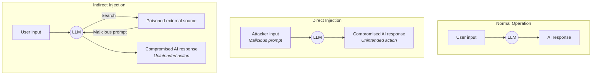
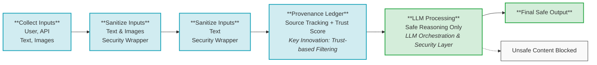
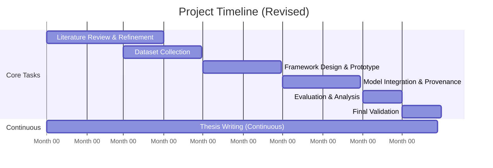

## TABLE OF CONTENTS

| Section | Page |
| :--- | :--- |
| ACKNOWLEDGMENTS | III |
| ABSTRACT | IV |
| CHAPTER 1: INTRODUCTION | 1 |
| CHAPTER 2: LITERATURE REVIEW | 5 |
| CHAPTER 3: METHODOLOGY | 15 |
| CHAPTER 4: RESULTS AND CONCLUSION | 25 |
| CHAPTER 5: WORK PLAN | 30 |
| REFERENCES | 35 |
| VITAE | 40 |

---

## ABSTRACT

The rapid advancement of Large Language Models (LLMs) and Vision-Language Models (VLMs) has created new pathways for multimodal prompt-injection attacks, where malicious instructions are hidden not only in text but also in images, metadata, OCR-extracted content, and tool-generated outputs. Existing defenses rely primarily on text-only filtering and lack the architectural ability to detect, sanitize, and verify heterogeneous inputs across agent-based AI systems. 

This research proposes an end-to-end Provenance-Aware Multimodal Multi-Agent Defense Framework designed to analyze, sanitize, and validate all inputs before they reach the LLM. The methodology integrates several coordinated components: a Unified Input Layer for secure data ingestion; a customized Security Wrapper Chain for multimodal sanitization; GraphChain for structural content mapping and trust-flow representation; a LangGraph multi-agent security pipeline composed of text, image, provenance, and policy-filter agents; and an MCP-based tool-safety layer to sandbox and verify external tool outputs. Sanitized and provenance-tagged content is finally passed to a Secure LLM Reasoning module, followed by an Output Validator ensuring policy compliance and preventing leakage. 

The expected outcomes include significantly improved detection accuracy for multimodal prompt-injection attacks, reduced cross-agent propagation of malicious instructions, and enhanced explainability through token and pixel-level provenance tracking. This framework aims to establish a foundational defense architecture for next-generation agentic AI systems, demonstrating that multimodal sanitization, provenance modeling, and multi-agent validation are essential for securing modern LLM and VLM ecosystems.

---

## CHAPTER 1 - INTRODUCTION

### 1.1 Background & Overview
The rapid advancement of Artificial Intelligence (AI) has been driven by the emergence of Large Language Models (LLMs) such as GPT-4, Claude, and PaLM, which now demonstrate strong capabilities in reasoning, planning, and understanding complex instructions. With the evolution of Vision-Language Models (VLMs) like GPT-4V, Gemini-Vision, and LLaVA, AI systems have become multimodal—able to analyze and interpret both textual and visual inputs. This expansion of capabilities has significantly improved human-AI interaction across domains such as cybersecurity, automation, and digital services.

However, it has also introduced a new generation of security vulnerabilities. One of the most critical emerging threats is the Prompt Injection Attack (PI). In this attack, an adversary embeds hidden or malicious instructions within user inputs to override safety policies and manipulate the model's behavior. While early prompt injection mainly appeared in plain text, modern attacks increasingly exploit multimodal inputs. Hidden instructions may be encoded inside images, displayed text, metadata, or steganographic patterns that can be extracted by VLMs through OCR or visual reasoning. These attacks can deceive an AI model into revealing sensitive data, executing unauthorized actions, or violating policy constraints.

The risk becomes even more severe in multi-agent AI ecosystems, where multiple LLM-powered agents collaborate to perform tasks. In these settings, a single compromised prompt can propagate across agents, leading to cascading failures—known as prompt infection. Current defenses, such as rule-based filtering, classifier-based detection, guard prompts, or reinforcement-aligned guard agents, remain largely monomodal. They focus on text-only sanitization and cannot detect multimodal attacks or analyze the provenance, trustworthiness, and flow of information exchanged between agents.

Existing research consistently shows that:
* No existing framework handles multimodal (text + image) prompt injection effectively.
* No defense mechanism incorporates provenance tracking to determine where a piece of information originated from.
* Multi-agent systems lack cross-agent trust validation, making them susceptible to cascading compromise.
* Attack success rates remain high, with up to 86% success in real-world applications and 56% success across tested LLM architectures.

Therefore, despite significant progress in understanding prompt injection attacks, there is no unified, end-to-end defense framework that can analyze, sanitize, and validate multimodal inputs while preserving explainability and trust propagation across agents.

To address these research gaps, this study proposes an integrated defense framework built on a multi-agent architecture, supported by robust provenance and trust-tracking mechanisms, to provide comprehensive protection against prompt injection attacks in both textual and visual modalities. The proposed framework follows a structured methodological pipeline that includes a Unified Input Layer for capturing all incoming data, a customized Security Wrapper Chain within LangChain for intercepting and processing every input, and a multimodal sanitization module capable of performing semantic text analysis, OCR-based extraction from images, metadata inspection, and steganographic cue detection.

After sanitization, GraphChain constructs a structural map of the input capturing relationships, trust paths, and modality interactions before the data enters the LangGraph multi-agent security pipeline. This pipeline consists of several dedicated security agents, including the Text Sanitizer Agent, Image Sanitizer Agent, Provenance Agent, and Policy Verification Agent, each contributing layered checks to ensure comprehensive filtering and validation. The framework also integrates MCP (Model Context Protocol) to isolate system tools and prevent unsafe tool calls during execution. Meanwhile, the Secure LLM Reasoning module ensures that the main model receives only sanitized, trust-tagged inputs with clearly defined safety constraints. Finally, an Output Validator performs post-processing checks to prevent policy violations, data leakage, or unintended harmful outputs.

---

### Figure 1: Direct vs Indirect Prompt Injection

*Caption: **Figure 1 - Direct vs Indirect Prompt Injection**: This diagram illustrates three scenarios. (Left) Normal operation where standard user input results in a standard AI response. (Middle) Direct injection where an attacker supplies a malicious prompt directly to the LLM, resulting in a compromised response. (Right) Indirect injection where an attacker poisons an external source; the LLM fetches this data during regular operation, inadvertently executing the malicious payload and leading to a compromised response.*

---

### 1.2 Problem Statement

Existing multi-agent frameworks for prompt injection defense effectively mitigate text-based attacks but fail to address multimodal threats. Vision-language models are vulnerable to attacks that hide malicious instructions within images, captions, metadata, or steganographic patterns. Such multimodal prompt injection can cause unintended model behavior, data leakage, or policy violations. Moreover, there is currently no unified mechanism for tracking the provenance and trustworthiness of multimodal inputs or for ensuring cross-agent validation consistency. Therefore, this research investigates how to design and evaluate a multimodal, provenance-aware defense architecture capable of sanitizing and validating both textual and visual inputs prior to LLM inference.

### 1.3 Research Questions

1. How can prompt injection be detected and mitigated when malicious content is present on data?
2. What role does provenance tracking play in explainability and policy compliance?
3. How can multi-agent collaboration reduce injection success rates without harming performance?
4. What metrics best measure multimodal trust leakage and system robustness?

### 1.4 Research Objectives

1. To design a framework that can check and sanitize user and API inputs for Prompt Injection before sending them to the LLM.
2. To create a provenance ledger that records the source of inputs and assigns a trust score to each element for provenance tracking of inputs to detect prompt injection.
3. To Extend Agentic AI framework by adding security layer for sanitization of inputs and outputs to detect prompt injection.

### 1.5 Significance of the Study

This research provides the first unified multimodal defense mechanism with provenance tracking for multi-agent systems. It addresses real-world threats across text, images, APIs, and tool interactions. The results contribute to AI safety, explainability, and secure autonomous reasoning pipelines.

### 1.6 Scope and Limitations

* Focuses on prompt injection, not model poisoning or adversarial ML.
* Covers text & image modalities.
* Evaluated on controlled multimodal datasets; real-world deployment is out of scope.
* Uses open-source VLMs (LLaVA, BLIP-2) and LangChain/LangGraph integrations.

---

## CHAPTER 2 - LITERATURE REVIEW

### 2.1 Theoretical Background

Large Language Models (LLMs) and their integration into autonomous agent-based systems have introduced advanced reasoning, planning, and tool-execution capabilities. These agent frameworks incorporate components such as retrieval-augmented generation (RAG), long-term memory, external tools, and multi-agent collaboration creating complex operational pipelines. While these advancements significantly enhance AI performance, they also introduce new security vulnerabilities not present in standalone LLMs.

A central emerging threat across these pipelines is Prompt Injection (PI), where adversaries insert malicious or hidden instructions to override system policies or manipulate model behavior. Prompt injection appears in two primary forms:

* **Direct and Indirect Textual Prompt Injection** using crafted, obfuscated, or contextual language-based cues.
* **Multimodal Prompt Injection**, where harmful instructions are embedded in images, screenshots, PDFs, or metadata.

Additional threats, such as action hijacking, RAG manipulation, data-flow leakage, and cross-agent interference, reveal the systemic vulnerabilities in agent ecosystems. This chapter reviews the literature surrounding these vulnerabilities and establishes the foundation for identifying research gaps.

### 2.2 Related Work

**Theme 1: Vulnerabilities in LLM Agent Pipelines**
Recent studies highlight that agent-based systems expose broader and more dynamic attack surfaces compared to single LLM systems. *AI Agents Under Threat (2024)* categorizes threats including unsafe memory retrieval, tool manipulation, cross-agent interference, and environmental exploits but lacks real-world validation. *Blue and Red Teaming with AI Agents (2024)* shows how agents can unintentionally propagate misinformation, emphasizing risks in adversarial information operations.

**Theme 2: Prompt Injection and Evolving Exploit Techniques**
Prompt Injection remains one of the most widely studied attack vectors.

* Ferrag et al. (2025) describe advanced multi-step attacks (P2RAG, P2SQL, P2Tool), demonstrating that prompt injection has evolved beyond simple text manipulations.
* *Prompt Injection 2.0 (2025)* reveals hybrid jailbreaks combining translation shifts, obfuscation, and role manipulation.
* *LLM Agent Honeypot (2025)* shows real-world malicious agents intentionally designed to attack other agents.
* HOUYI (Liu et al., 2024) demonstrates an 86.1% attack success rate in commercial systems, using a three-component payload that forces LLMs to reinterpret malicious prompts as legitimate input.

**Theme 3: Multimodal Prompt Injection Attacks**
Modern LLMs can interpret images and text jointly, creating new multimodal attack channels.

* *Multimodal Prompt Injection Attacks (2025)* evaluates eight commercial models and shows that none resist image-based or OCR-based attacks. GPT-4 and Claude 3 were vulnerable when images contained hidden textual instructions. Vulnerabilities often occur during context assembly, when untrusted multimodal content merges with system prompts.
* Yeo & Choi (2025) further classify four multimodal attack types and reinforce that multimodal PI is an unresolved and expanding threat.

**Theme 4: Action Hijacking, Data Exfiltration, and Control-Flow Subversion**
Agent workflows introduce novel execution-stage vulnerabilities.

* *AI² (2025)* introduces an attack inspired by Return-Oriented Programming (ROP), hijacking reasoning and tool actions without harmful user input.
* *AgentDojo (2025)* provides a simulation environment for testing multi-step exploit chains.
* *AgentVigil (2024)* demonstrates weaknesses to indirect prompt injection using black-box evaluation.
* Alizadeh et al. (2025) reveal data-flow prompt injection, where agents leak sensitive information during tool execution even when input appears benign.

**Theme 5: Defensive Mechanisms and Early Mitigation Attempts**
Several works attempt to secure agents but remain incomplete:

* *Design Patterns for Securing LLM Agents (2025)* introduces high-level defensive patterns but lacks empirical evaluation.
* Multi-Agent PI Detection Frameworks (Gosmar et al., 2025) provide layered filtering but remain text-only.
* MELON (2024) provides provable defenses against indirect PI but does not address multi-step planning or multimodal workflows.

**Theme 6: Broader Architectural Weaknesses Across Models**

* *Is AI Hijacking Our Agency? (2024)* highlights socio-technical vulnerabilities such as user manipulation and overtrust.
* Benjamin et al. (2025) evaluate 36 model architectures, showing 56% overall PI success rate, with mid-sized models being most vulnerable. This demonstrates that PI weaknesses are architectural and industry-wide—not limited to specific models.

### 2.2.1 Comparison Table

| Study | Modalities | Multimodal Support | Multi-Agent | Provenance Tracking | Strength | Limitation |
| --- | --- | --- | --- | --- | --- | --- |
| **Gosmar 2025** Multi-Agent PI Detection | Text | X | ✓ | X | Strong layered filtering | No multimodal handling |
| **Hossain 2024** Agent Defense Pipeline | Text | X | ✓ | X | Agent coordination | High latency, text-only |
| **Lee 2024** Prompt Infection | Text | X | ✓ | X | Reveals multi-agent infection | No multimodal or defense |
| **Mathew 2024** Security LLM Survey | Text | X | X | X | Broad review focus | No agent or multimodal |
| **Beurer-Kellner 2025** Agent Security Patterns | Text | X | ✓ | X | Engineering design patterns | No OCR or non-text defense |
| **McHugh 2025** Prompt Injection 2.0 | Text + Hybrid | Limited (some hybrid cues) | X | X | Defines hybrid threats | No defense; not fully multimodal |
| **Volkov 2025** LLM Agent Honeypot | Text | X | ✓ | X | Real-world agent logs | No VLM or cross-modal threats |
| **Zhu 2024** MELON IPI Text Defense | Text | X | X | X | Provable robustness | Text-only; no agent context |
| **Zhang 2025** AI Action Hijacking | Text | X | ✓ | X | Breaks agent planning | No multimodal; no provenance |
| **AgentDojo 2025** Agent Simulation | Text | X | ✓ | X | Strong simulation tasks | No multimodal |
| **AgentVigil 2024** Indirect PI Stress-Test | Text | X | ✓ | X | Black-box robustness testing | No multimodal tracking |
| **Ferrag 2025** Protocol Exploits | Text + Tool | X | ✓ | X | Exposes P2SQL, P2RAG | No multimodal defense or provenance |
| **Watkins 2024** AI Hijacking Our Agency | Text | X | ✓ | X | Human-AI behavioral insight | Not technical; no detection or multimodal |
| **Yeo & Choi 2025** Multimodal Prompt Injection Attacks | Text + Image | ✓ (Strong) | X | X | First systematic multimodal PI evaluation; identifies OCR-based risks | No multi-agent or provenance; detection only |
| **Liu et al. 2024 (HOUYI)** Prompt Injection LLM-integrated Applications | Text | X | X | X | Real-world application evaluation; 86% attack success; black-box | No multimodal evaluation; no agent workflow focus |
| **Alizadeh et al. 2025** Simple PI Attacks Leak Agent Data | Text | X | ✓ (tool-calling agents) | X | Shows data-flow leakage; tests on AgentDojo; reveals execution-level vulnerabilities | No multimodal tests; limited to banking workflows |
| **Benjamin et al. 2025** Systematically Analyzing PI Vulnerability in 36 LLMs | Text | X | X | X | Large-scale architectural vulnerability analysis; 56% success rate | No multimodal dimension; no agent context |

### 2.3 Critical Analysis / Research Gap

A synthesis of all reviewed literature reveals major systemic shortcomings:

* **Gap 1: No End-to-End Security Framework for Agent Pipelines:** Current defenses target isolated components but fail to secure the entire agent workflow from input to output.
* **Gap 2: No Protection Against Action Hijacking and Execution-Level Attacks:** Attacks such as AI² can hijack agent reasoning and tool execution even when no harmful text appears in the input.
* **Gap 3: Weak Evaluation Environments:** Most evaluations use synthetic datasets or simulations lacking real-world multimodal, multi-step scenarios.
* **Gap 4: Limited Study of Cascading Failures in Multi-Agent Systems:** Research focuses on individual agents but seldom explores how malicious prompts propagate across cooperating agents.
* **Gap 5: Multimodal Attack Surfaces Remain Unaddressed:** Almost all existing systems are text-only. No framework handles image-based attacks, OCR-extracted hidden text, metadata-based or steganographic instructions.
* **Gap 6: No Provenance-Aware or Trust-Aware Architecture:** Current systems cannot track the origin of text/images, how trust propagates, or which components are compromised.
* **Gap 7: Overreliance on Reactive Defenses:** Most defenses attempt pattern matching, rewriting, guardrails, and post-generation filtering. These fail against advanced attacks like HOUYI or AI².

---

## CHAPTER 3 - PROPOSED METHODOLOGY

### 3.1 Framework Overview

The proposed framework establishes a unified and extensible defense pipeline designed to detect and mitigate prompt injection attacks across different types of inputs, whether textual or multimodal. Instead of restricting the system to a specific data channel, the architecture is constructed to accommodate any form of structured or unstructured user input, API output, or agent-generated content. The framework operates through three integrated layers: an **Input Sanitization Layer** that examines and filters incoming data; a **Provenance Ledger** that records the origin, transformation, and trust profile of every input; and an **Agentic Security Layer** that enforces policies and validates interactions within the agent workflow. Together, these components create a comprehensive defense mechanism capable of monitoring input integrity, preventing the spread of malicious instructions between agents, and strengthening the reliability of agentic AI systems regardless of modality.

### 3.2 Data Acquisition

The proposed framework is evaluated using a publicly available and well-established dataset that contains a wide range of prompt injection attempts and adversarial instructions across different input modalities. This published dataset includes examples of direct and indirect injection patterns, role-misleading commands, system overriding attempts, and manipulative sequences commonly used to compromise agentic workflows. The dataset also features inputs originating from multiple sources such as user prompts, tool outputs, and API-generated content—making it suitable for evaluating multimodal agent systems without restricting the framework to a single input form. Using a standardized and peer-reviewed dataset ensures reproducibility, enables objective benchmarking against existing approaches, and enhances the scientific validity of the experimental evaluation.

### 3.3 Data Preprocessing

All acquired inputs undergo a preprocessing stage intended to standardize and structure the data for both sanitization and provenance tracking. This process includes normalizing the format of the content, segmenting complex inputs into interpretable components, and encoding metadata needed for tracking the flow of information between agents. Additionally, each input is assigned an initial trust score based on its source and its behavioral characteristics. These preprocessing steps ensure consistent handling of different input types and prepare the data for deeper analysis within the sanitization and security layers.

### 3.4 Proposed Models / Algorithms

The defense framework employs a combination of analytical and trust-aware algorithms designed to detect prompt injection attempts across variable modalities. The Input Sanitization Layer applies structural and semantic inspection methods to uncover manipulative patterns that may attempt to override or circumvent system policies. The Provenance Ledger implements a trust-propagation mechanism that tracks how information evolves as it flows between agents, adjusting trust scores and identifying suspicious transformations. The Agentic Security Layer then evaluates both incoming inputs and agent-generated outputs to interrupt harmful sequences before they propagate.

### 3.5 Tools and Technologies

The implementation of the proposed framework relies on modern AI development and cybersecurity research tools. Python serves as the primary development environment due to its extensive ecosystem for handling structured and unstructured data, including multimodal representations. Lightweight AI models are utilized to simulate agent reasoning, while agent orchestration frameworks support the integration of security layers and provenance mechanisms. Logging and monitoring tools capture interaction patterns and trust transitions, enabling reproducible experimentation and systematic analysis.

---

## CHAPTER 4 - EXPERIMENTAL DESIGN & EVALUATION

### 4.1 Evaluation Metrics

The proposed defense framework is evaluated using a set of metrics specifically selected to measure its ability to detect and mitigate prompt injection attacks within multi-agent AI environments. Core performance indicators include **Precision, Recall, and F1-score**, which collectively assess how accurately the system identifies malicious inputs while minimizing both false positives and false negatives. Additionally, the **Policy Compliance Rate (PCR)** measures the extent to which the system adheres to predefined safety rules when processing user inputs or agent-to-agent communications. To evaluate the reliability of provenance tracking, the **Provenance Trust Consistency Index** is used to assess how closely the trust scores generated by the ledger align with the actual risk levels associated with each input as it propagates through the workflow. The **Task Accuracy Retention (TAR)** metric examines whether the defensive layers affect the system's ability to complete its assigned tasks without degradation. Finally, **Latency Overhead** is analyzed to ensure that the framework does not introduce excessive computational delays.

### 4.2 Baseline Models

To contextualize the performance of the proposed framework, it is compared against several baseline models commonly used for defending against prompt injection attacks. These include traditional text-based sanitization models, which rely on static rule sets to filter harmful content but lack contextual awareness or multi-agent coordination. Another baseline consists of standard multi-agent defense mechanisms that apply simple message-filtering policies without incorporating provenance tracking or trust evaluation. A third baseline leverages an established method such as MELON, which focuses on defending against indirect prompt injection but does not provide multi-layer protection across sanitization, provenance, and workflow validation.

### 4.3 Validation Strategy

The validation strategy follows a multi-stage methodology designed to assess the robustness and generalizability of the proposed framework under realistic operational conditions. The evaluation begins with a published dataset of prompt injection attacks, containing diverse examples of both direct and indirect manipulation attempts across different input modalities. Each input is processed sequentially through the sanitization module, provenance ledger, and agentic security layer, allowing detailed observation of how the system responds at each stage. The strategy also includes cross-agent propagation simulations, in which malicious instructions are intentionally introduced into multi-agent workflows to measure the system's ability to prevent the spread of injected content across agents. To ensure reliability and repeatability, cross-validation and ablation testing are conducted, isolating the contribution of each defense component. Furthermore, Policy Override Analysis is performed to quantify how often adversarial inputs successfully bypass operational constraints.

### 4.4 Workflow of Proposed Solution

### Figure 2: Proposed Secure Data Ingestion and LLM Workflow with Provenance

*Caption: **Figure 2 - Workflow of proposed solution**: The diagram outlines the step-by-step pipeline. Data (text and images) is collected and passed through consecutive Security Wrappers for sanitization. It then enters the Provenance Ledger, which assigns a trust score based on the source. Only validated, trusted data proceeds to the LLM for processing, guaranteeing a final safe output and blocking unsafe pathways.*

---

## CHAPTER 5 - WORK PLAN (TIMELINE)

### Figure 3: Project Timeline (Gantt Chart) - Revised

*Caption: **Project Timeline (Gantt Chart)**: A visual representation of the project's schedule over a 10-month period. Activities are staged sequentially, beginning with the Literature Review and ending with Final Validation in month 10, while Thesis Writing spans continuously across the entire duration.*

---

## REFERENCES

[1] A. Ghosh et al., "AI Agents Under Threat: A Survey of Key Security Challenges," 2024.
[2] R. Watkins et al., "Blue and Red Teaming with AI Agents in Information Operations," 2024.
[3] M. A. Ferrag et al., "From Prompt Injections to Protocol Exploits: Threats in LLM-Powered AI Agent Workflows," 2025.
[4] J. McHugh et al., "Prompt Injection 2.0: Hybrid AI Threats," 2025.
[5] D. Gosmar et al., "Prompt Injection Detection and Mitigation via AI Multi-Agent NLP Frameworks," 2025.
[6] D. Lee and M. Tiwari, "LLM Agent Honeypot: Monitoring AI Hacking Agents in the Wild," 2025.
[7] L. Beurer-Kellner et al., "Design Patterns for Securing LLM Agents Against Prompt Injections," 2025.
[8] Y. Zhang et al., "Towards Action Hijacking of Large Language Model-based Agents (AI²)," 2025.
[9] R. Volkov et al., "AgentVigil: Generic Black-Box Red Teaming for Indirect Prompt Injection Against LLM Agents," 2024.
[10] K. Chen et al., "AgentDojo: A Dynamic Environment to Evaluate LLM Agent Behaviors," 2025.
[11] E. Mathew, "Enhancing Security in Large Language Models: A Comprehensive Survey," 2024.
[12] R. Watkins et al., "Is AI Hijacking Our Agency?" 2024.
[13] M. A. Ferrag et al., "MELON: Provable Defense Against Indirect Prompt Injection," 2024.
[14] Yeo and D. Choi, "Multimodal Prompt Injection Attacks: Risks and Defenses for Modern LLMs," 2025.
[15] Y. Liu et al., "Prompt Injection Attack Against LLM-integrated Applications," 2024.
[16] M. Alizadeh, Z. Samei, D. Stetsenko, and F. Gilardi, "Simple Prompt Injection Attacks Can Leak Personal Data Observed by LLM Agents During Task Execution," 2025.
[17] V. Benjamin et al., "Systematically Analyzing Prompt Injection Vulnerabilities in Diverse LLM Architectures," 2025.