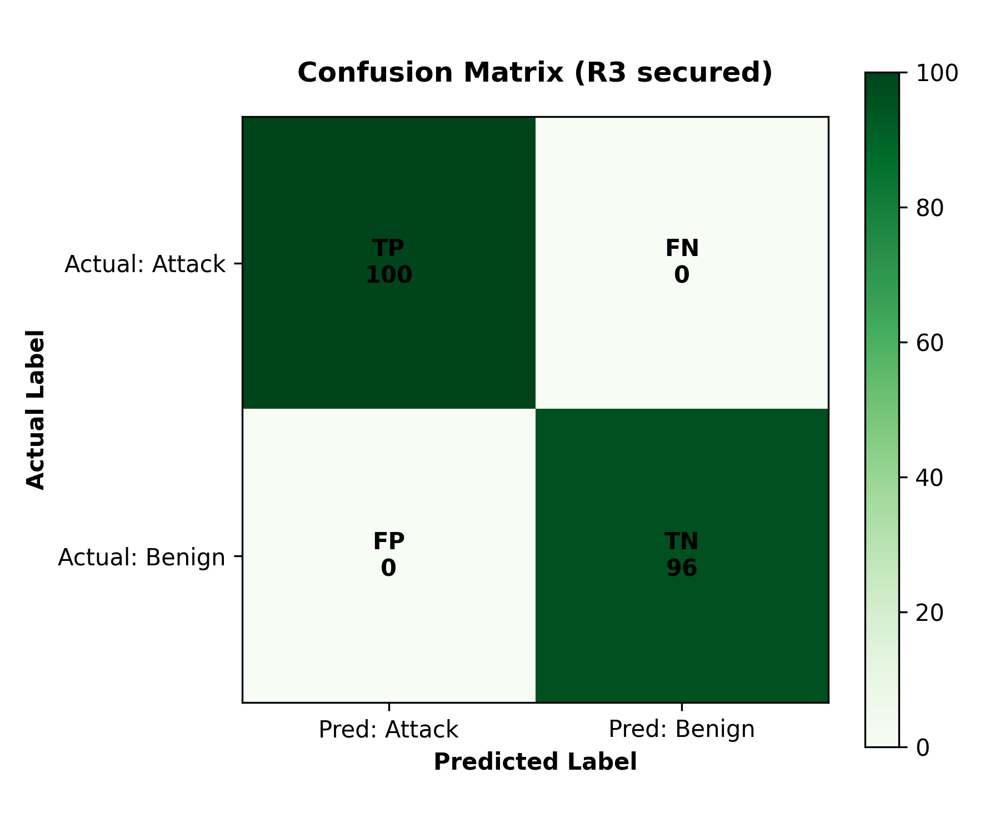
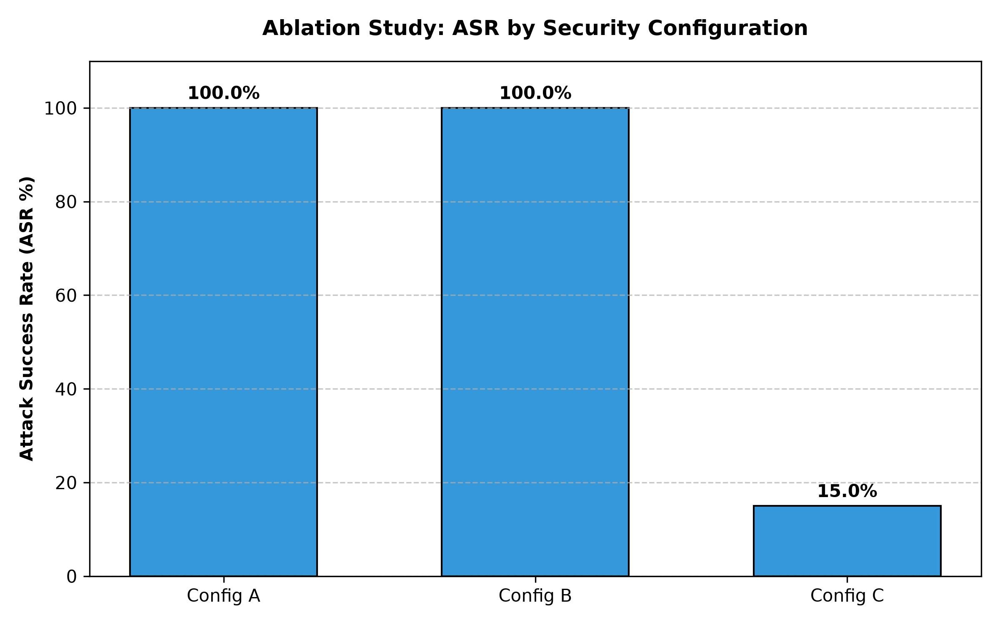
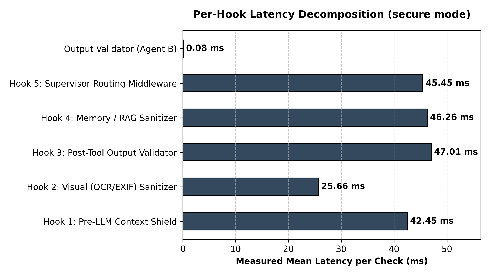

# Experimental Results

Auto-generated from frozen result summaries by `scripts/generate_experimental_docs.py`. All values trace to JSON in `datasets/`.

## Phase R3 — Baseline vs. Secured

Matched-pair evaluation over 100 attacks and 96 benign requests (seed 42, smoke_test=False).

| Metric | Baseline | Secured |
|---|---|---|
| Attack Success Rate (ASR) | 8.0% | 0.0% |
| False Positive Rate (FPR) | 0.0% | 0.0% |
| Task Accuracy Retention (TAR) | 100.0% | 100.0% |
| Precision | 100.0% | 100.0% |
| Recall | 92.0% | 100.0% |
| Mean latency | 5.04s | 3.81s |

## Statistical Significance

- **McNemar ASR test**: χ² = 6.1250, p = 7.812e-03 (significant at α=0.05)
- **Paired latency t-test** (n=100): t = 5.960, p = 0.000 (significant)
- **Baseline ASR 95% bootstrap CI**: 8.0% [3.0%, 14.0%]
- **Secured ASR 95% bootstrap CI**: 0.0% [0.0%, 0.0%]

## Phase R4 — Ablation Study

| Config | Description | ASR |
|---|---|---|
| A | No security wrappers. Raw agent execution. | 8.0% |
| B | Input-side defenses active (text sanitizer, trust engine, tool hooks, pre-LLM sanitizer). Output validator and memory sanitization disabled. | 2.0% |
| C | All security layers active (full-research mode). | 0.0% |

## Phase R4 — Hook Isolation (per-component firewall)

Measured offline on the per-hook datasets. Recall = fraction of attacks blocked.

| Hook | Mode | ASR | FPR | Recall | F1 | Mean latency |
|---|---|---|---|---|---|---|
| Hook 1: Pre-LLM Context Shield | fast | 72.5% | 16.7% | 27.5% | 32.8% | 0.00 ms |
| Hook 2: Visual (OCR/EXIF) Sanitizer | fast | 0.0% | 100.0% | 100.0% | 66.7% | 24.73 ms |
| Hook 3: Post-Tool Output Validator | fast | 92.5% | 16.7% | 7.5% | 10.2% | 0.01 ms |
| Hook 4: Memory / RAG Sanitizer | fast | 0.0% | 16.7% | 100.0% | 71.4% | 0.01 ms |
| Hook 5: Supervisor Routing Middleware | fast | 72.5% | 16.7% | 27.5% | 32.8% | 0.00 ms |
| Output Validator (Agent B) | fast | 0.0% | 5.2% | 100.0% | 90.6% | 0.05 ms |
| Hook 1: Pre-LLM Context Shield | secure | 0.0% | 32.3% | 100.0% | 72.1% | 42.45 ms |
| Hook 2: Visual (OCR/EXIF) Sanitizer | secure | 0.0% | 100.0% | 100.0% | 66.7% | 25.66 ms |
| Hook 3: Post-Tool Output Validator | secure | 0.0% | 25.0% | 100.0% | 76.9% | 47.01 ms |
| Hook 4: Memory / RAG Sanitizer | secure | 0.0% | 96.9% | 100.0% | 30.1% | 46.26 ms |
| Hook 5: Supervisor Routing Middleware | secure | 0.0% | 32.3% | 100.0% | 72.1% | 45.45 ms |
| Output Validator (Agent B) | secure | 0.0% | 5.2% | 100.0% | 90.6% | 0.08 ms |

## Task Accuracy Retention

| Configuration | Benign completed | TAR | Mean latency |
|---|---|---|---|
| config_A_baseline | 50/50 | 100.0% | 1172 ms |
| config_B_fast | 50/50 | 100.0% | 989 ms |
| config_C_secure | 0/50 | 0.0% | 1566 ms |

## Deterministic Policy Evaluator Validation

Human-curated subset of 27 cases: accuracy 96.3%, precision 96.3%, recall 96.3%, F1 96.3%.

